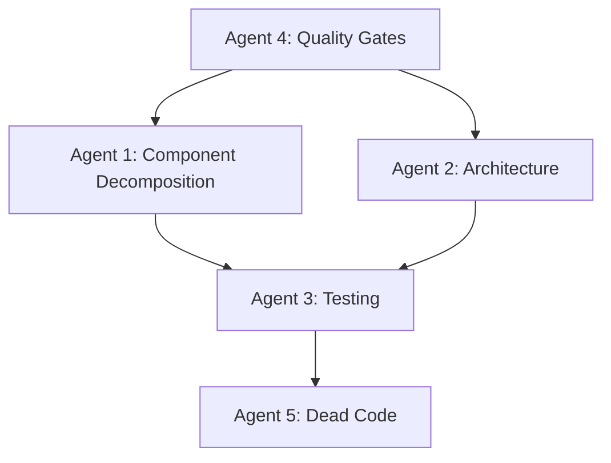

# AI Agent Technical Specifications

## 🤖 **AGENT 1: COMPONENT DECOMPOSITION SPECIALIST**

### Objective
Transform monolithic components into focused, reusable, testable components following single responsibility principle.

### Current Problems to Solve
- App.tsx: 1,253 lines handling 5 different workflow steps
- SimplifiedCampaignCreator.tsx: 1,935 lines with mixed concerns
- Modal components > 500 lines each
- Inline component definitions creating code duplication

### Technical Specifications

#### 1.1 App.tsx Decomposition
```typescript
// Target structure:
src/
  components/
    steps/
      LocationSelectionStep.tsx         // ~150 lines max
      CampaignSettingsStep.tsx          // ~100 lines max  
      AdConfigurationStep.tsx           // ~150 lines max
      ReviewStep.tsx                    // ~200 lines max
      ResultsStep.tsx                   // ~100 lines max
    layout/
      AppLayout.tsx                     // ~50 lines
      StepNavigation.tsx                // ~100 lines
    shared/
      NotificationSystem.tsx            // ~80 lines
```

**Key Extraction Rules:**
- Each step component manages only its own state
- Pass data via props, receive updates via callbacks
- Extract animation variants to shared constants
- Move step-specific logic to custom hooks

#### 1.2 SimplifiedCampaignCreator Decomposition
```typescript
// Target structure:
src/
  components/
    campaign/
      CampaignCreator.tsx               // Main orchestrator ~100 lines
      LocationSelector.tsx              // ~200 lines max
      CampaignSettings.tsx              // ~150 lines max
      LocationFilter.tsx                // ~100 lines max
      StatsSummary.tsx                  // ~80 lines max
      CampaignActions.tsx               // ~100 lines max
    shared/
      BooleanCheckbox.tsx               // ~30 lines
      CollapsibleSection.tsx            // ~50 lines
      LocationItem.tsx                  // ~100 lines
```

#### 1.3 Modal Decomposition Rules
- Create `BaseModal.tsx` with common modal patterns
- Extract form logic to separate components
- Use compound component patterns for complex modals
- Maximum 200 lines per modal component

### Acceptance Criteria
- [ ] No component exceeds 300 lines
- [ ] Each component has single responsibility
- [ ] All inline components extracted to files
- [ ] Props interfaces clearly defined
- [ ] TypeScript strict mode compliance
- [ ] All components properly exported

### Implementation Commands
```bash
# Component creation structure
mkdir -p src/components/{steps,layout,shared,campaign,forms}

# Template for each component
echo "// Component: [Name]
// Purpose: [Single responsibility]
// Props: [Interface definition]
// State: [Local state description]
// Dependencies: [External dependencies]" > component-template.tsx
```

---

## 🤖 **AGENT 2: ARCHITECTURE CONSISTENCY ENGINEER**

### Objective
Establish consistent patterns for state management, data fetching, error handling, and component communication.

### Current Problems to Solve
- Inconsistent state management (useState vs. useEffect chains)
- Direct service calls in components
- Mixed API patterns (mockApi vs supabase)
- No centralized error handling
- Props drilling for global state

### Technical Specifications

#### 2.1 State Management with Zustand
```typescript
// Target store structure:
src/
  stores/
    useCampaignStore.ts               // Campaign state & actions
    useLocationStore.ts               // Location data & filtering
    useUIStore.ts                     // Modals, loading, notifications
    useUserStore.ts                   // User preferences & auth
```

**Store Implementation Standards:**
```typescript
interface CampaignStore {
  // State
  campaigns: Campaign[]
  currentCampaign: CampaignConfiguration | null
  isLoading: boolean
  error: string | null
  
  // Actions
  loadCampaigns: () => Promise<void>
  createCampaign: (config: CampaignConfiguration) => Promise<void>
  updateCampaign: (id: string, updates: Partial<CampaignConfiguration>) => Promise<void>
  clearError: () => void
}
```

#### 2.2 Custom Hooks for Data Fetching
```typescript
// Target hook structure:
src/
  hooks/
    useLocations.ts                   // Location data management
    useCampaigns.ts                   // Campaign operations
    useTemplates.ts                   // Template management
    useGenerateAds.ts                 // Ad generation workflow
    useLocationConfig.ts              // Location configuration
```

**Hook Implementation Standards:**
```typescript
interface UseLocationsReturn {
  locations: LocationWithConfig[]
  isLoading: boolean
  error: string | null
  refetch: () => Promise<void>
  searchLocations: (query: string) => Promise<void>
  selectLocation: (id: string) => void
  selectedLocations: LocationWithConfig[]
}
```

#### 2.3 Unified API Service
```typescript
// Target service structure:
src/
  services/
    api/
      ApiService.ts                   // Base API class
      LocationApiService.ts           // Location operations
      CampaignApiService.ts           // Campaign operations
      TemplateApiService.ts           // Template operations
    errors/
      ApiError.ts                     // Structured error handling
      ErrorBoundary.tsx               // React error boundary
```

### Acceptance Criteria
- [ ] All global state managed through Zustand stores
- [ ] No prop drilling beyond 2 levels
- [ ] Consistent error handling across all API calls
- [ ] All data fetching through custom hooks
- [ ] TypeScript interfaces for all API responses
- [ ] Request/response interceptors implemented

---

## 🤖 **AGENT 3: TESTING SPECIALIST**

### Objective
Achieve 90%+ test coverage with robust unit, integration, and E2E tests.

### Current Problems to Solve
- Only 2 test files in entire codebase
- No mocking infrastructure
- No integration test coverage
- No E2E test coverage
- No test utilities or factories

### Technical Specifications

#### 3.1 Testing Infrastructure Setup
```typescript
// Target test structure:
src/
  test/
    utils/
      testUtils.tsx                   // Testing utilities & providers
      renderWithProviders.tsx         // Render with stores/context
      mockData.ts                     // Test data factories
    mocks/
      handlers.ts                     // MSW request handlers
      server.ts                       // MSW server setup
    fixtures/
      campaigns.ts                    // Campaign test data
      locations.ts                    // Location test data
      templates.ts                    // Template test data
```

#### 3.2 Test Coverage Requirements
```bash
# Minimum coverage requirements:
Components: 95%
Hooks: 95%
Services: 90%
Stores: 95%
Utils: 100%
Overall: 90%
```

#### 3.3 Test Patterns & Standards
```typescript
// Component test template:
describe('ComponentName', () => {
  beforeEach(() => {
    // Setup MSW handlers
    // Clear all stores
  })

  it('renders with default props', () => {
    // Test basic rendering
  })

  it('handles user interactions', () => {
    // Test click handlers, form submissions
  })

  it('displays loading states', () => {
    // Test loading/error states
  })

  it('handles error states gracefully', () => {
    // Test error scenarios
  })
})
```

#### 3.4 E2E Testing with Playwright
```typescript
// Target E2E structure:
tests/
  e2e/
    campaign-creation.spec.ts         // Full campaign workflow
    location-configuration.spec.ts   // Location setup flow
    file-generation.spec.ts           // Export functionality
    accessibility.spec.ts             // A11y compliance
```

### Acceptance Criteria
- [ ] 90%+ line coverage achieved
- [ ] All components have comprehensive tests
- [ ] MSW mocking for all API calls
- [ ] E2E tests for critical user paths
- [ ] Performance tests for large datasets
- [ ] Accessibility tests with axe-core

---

## 🤖 **AGENT 4: CODE QUALITY ENFORCER**

### Objective
Implement automated quality gates preventing low-quality code from entering the repository.

### Current Problems to Solve
- No git hooks for quality control
- Basic ESLint configuration
- No automated formatting
- No CI/CD quality gates
- Inconsistent code style

### Technical Specifications

#### 4.1 Husky Git Hooks Setup
```json
// package.json scripts to add:
{
  "scripts": {
    "prepare": "husky install",
    "pre-commit": "lint-staged",
    "pre-push": "npm run type-check && npm run test:coverage",
    "commit-msg": "commitlint --edit $1"
  }
}
```

#### 4.2 Enhanced ESLint Configuration
```typescript
// eslint.config.js enhancements:
export default [
  // Base configs
  ...baseConfigs,
  
  // Additional rules
  {
    rules: {
      // Performance
      'react-hooks/exhaustive-deps': 'error',
      
      // Code style  
      'prefer-const': 'error',
      'no-var': 'error',
      
      // Accessibility
      'jsx-a11y/alt-text': 'error',
      'jsx-a11y/aria-role': 'error',
      
      // Import organization
      'import/order': ['error', {
        'groups': ['builtin', 'external', 'internal', 'parent', 'sibling', 'index'],
        'newlines-between': 'always'
      }]
    }
  }
]
```

#### 4.3 Quality Gates Configuration
```yaml
# .github/workflows/quality.yml
name: Quality Gates
on: [push, pull_request]

jobs:
  quality:
    steps:
      - name: Lint
        run: npm run lint
      - name: Type Check  
        run: npm run type-check
      - name: Test Coverage
        run: npm run test:coverage
      - name: Build Verification
        run: npm run build
      - name: Bundle Size Check
        run: npm run bundle-analyze
```

### Acceptance Criteria
- [ ] Pre-commit hooks prevent bad commits
- [ ] ESLint catches style and performance issues
- [ ] Prettier enforces consistent formatting
- [ ] TypeScript strict mode enabled
- [ ] CI/CD pipeline blocks failing PRs
- [ ] Bundle size monitoring active

---

## 🤖 **AGENT 5: DEAD CODE ELIMINATION SPECIALIST**

### Objective
Identify and remove redundant, unused, or obsolete code to reduce bundle size and maintenance burden.

### Current Problems to Solve
- Unused npm dependencies
- Duplicate component logic
- Dead code paths
- Unused assets and files
- Overly complex configurations

### Technical Specifications

#### 5.1 Dependency Analysis
```bash
# Tools to use:
npx depcheck                          # Find unused dependencies
npx npm-check-updates                 # Update outdated packages  
npx bundle-analyzer                   # Analyze bundle composition
npx ts-unused-exports                 # Find unused exports
```

#### 5.2 Code Analysis Tools
```typescript
// AST analysis for unused code:
{
  "scripts": {
    "analyze:unused": "ts-unused-exports tsconfig.json",
    "analyze:deps": "depcheck",
    "analyze:bundle": "npm run build && npx webpack-bundle-analyzer dist/stats.json",
    "analyze:duplicates": "jscpd src/"
  }
}
```

#### 5.3 Cleanup Targets
```bash
# Files to analyze for removal:
src/components/ui/CampaignCreator.tsx    # Duplicate of SimplifiedCampaignCreator?
src/services/mockApi.ts                  # Development only?
src/data/mockData.ts                     # Replace with real data?
public/locations.json                    # Superseded by Supabase?
database/                                # Move to separate repo?
scripts/                                 # Consolidate utilities?
```

### Acceptance Criteria
- [ ] Bundle size reduced by 20%+
- [ ] No unused npm dependencies
- [ ] No duplicate component logic
- [ ] All dead code paths removed
- [ ] Simplified configuration files
- [ ] Updated documentation reflects changes

## Implementation Coordination

### Agent Dependencies


### Daily Sync Requirements
1. **Morning**: Review previous day's progress
2. **Midday**: Resolve any blocking dependencies  
3. **Evening**: Update progress and plan next day

### Quality Checkpoints
- **Day 3**: Basic infrastructure complete
- **Day 7**: Core components refactored
- **Day 14**: Testing infrastructure complete
- **Day 21**: All acceptance criteria met
